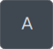
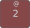
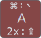

# Conventions de keymap (référence)

[](https://zmk.dev/)

Ce document reprend et traduit les conventions décrites dans le [README de Townk/zmk-config](https://github.com/Townk/zmk-config/blob/main/README.md) (référence de travail locale possible : `archive/zmk-config/README.md` à côté de ce dépôt, si tu utilises l’arborescence `keyboard/` complète). Il sert de **référence** pour les symboles, les représentations des touches et les comportements affichés sur les schémas.

**Médias** — Tous les liens pointent vers des fichiers **dans ce dossier** : [glyphs/](glyphs/) et [images/](images/).

---

## Organisation des layouts (idée générale)

La configuration est pensée autour d’un **layout maître** avec davantage de touches définies que le clavier physique n’en expose. Chaque cible matérielle fournit un **adaptateur de couches** qui mappe les touches du layout logique vers les positions physiques.

Pour **ce dépôt**, le matériel visé est le **Sofle Choc Pro Bluetooth** ; les schémas générés sont listés plus bas.

---

## Schémas de couches (Sofle)

Génération à la **racine du dépôt** : `make keymap-images` (SVG/PNG dans `docs/images/`).

| Couche | Fichier |
|--------|---------|
| Principal (QWERTY) | [images/sofle-layer0-main.svg](images/sofle-layer0-main.svg) |
| Navigation | [images/sofle-layer1-navigation.svg](images/sofle-layer1-navigation.svg) |
| Nombres | [images/sofle-layer2-numbers.svg](images/sofle-layer2-numbers.svg) |
| Symboles | [images/sofle-layer3-symbols.svg](images/sofle-layer3-symbols.svg) |
| Média | [images/sofle-layer4-media.svg](images/sofle-layer4-media.svg) |
| Souris | [images/sofle-layer5-mouse.svg](images/sofle-layer5-mouse.svg) |
| Fonctions | [images/sofle-layer6-functions.svg](images/sofle-layer6-functions.svg) |
| Boutons | [images/sofle-layer7-buttons.svg](images/sofle-layer7-buttons.svg) |
| Système | [images/sofle-layer8-system.svg](images/sofle-layer8-system.svg) |
| COLEMAK | [images/sofle-layer9-colemak.svg](images/sofle-layer9-colemak.svg) |
| Réf. RC (indices matrice) | [images/sofle-layer-rc-reference.svg](images/sofle-layer-rc-reference.svg) |

Aperçu HTML (couches 0–8) : [images/cheatsheet.html](images/cheatsheet.html).

> **Numéros sur les pictogrammes « couche »** — Dans le glossaire ci-dessous, les icônes `numeric-1` … `numeric-6` reprennent la **légende d’origine Townk** (libellés « Numbers », « Symbols », etc.). L’**index de couche** dans les noms de fichiers `sofle-layerN-…` peut ne pas coïncider avec ce chiffre sur l’icône ; se fier au **nom de fichier** et à la cheatsheet ci-dessus.

---

## Glossaire des symboles

Dans les fichiers de keymap et sur les visuels, des symboles hors usage courant dans les exemples ZMK sont utilisés. Tableau de référence :

| Symboles | Description |
|:--------:|-------------|
|  | Command (⌘ / Super) |
|  | Control (Ctrl) |
|  | Option (Alt / Meta) |
| ⇪ | Caps Word |
|  | Shift |
|  | Globe |
|  | Activer Caps Word |
|  | Espace |
|  | Entrée (Return / Ret) |
|  | Supprimer en arrière (Backspace / Bksp) |
|  | Supprimer en avant (Del) |
| ↖ | Home |
| ⇞ | Page précédente |
| ⇟ | Page suivante |
| ↘ | Fin |
|  | Backtab |
|  | Tab |
|  | Volume + |
|  | Volume − |
|  | Muet |
|  | Luminosité écran + |
|  | Luminosité écran − |
|  | Rétroéclairage clavier éteint |
|  | Rétroéclairage − |
|  | Rétroéclairage + |
|  | Piste précédente |
|  | Lecture / pause |
|  | Piste suivante |
|  | Arrêt média |
|  | Launchpad |
|  | Mission Control (`⌘ ⌃ ↑`) |
|  | Fenêtres de l’app (`⌘ ⌃ ↓`) |
|  | Spotlight |
|  | Couper (`⌘ X`) |
|  | Copier (`⌘ C`) |
|  | Coller (`⌘ V`) |
|  | Annuler (`⌘ Z`) |
|  | Rétablir (`⇧ ⌘ Z`) |
|  → | Suivant (`⌘ G`) |
| ←  | Précédent (`⇧ ⌘ G`) |
|  | Mot précédent (`⌥ ←`) |
|  | Mot suivant (`⌥ →`) |
|  | Début de ligne (`⌘ ←`) |
|  | Fin de ligne (`⌘ →`) |
|  → | Bureau virtuel à droite (`⌘ ⌃ →`) |
| ←  | Bureau virtuel à gauche (`⌘ ⌃ ←`) |
|  → | Fenêtre suivante (`` ⌘ ` ``) |
| ←  | Fenêtre précédente (`⌘ ~`) |
|  | Disposition alternative (COLEMAK) |
|  | Profil Bluetooth |
|  | Effacer le profil Bluetooth |
|  | Basculer l’affichage OLED (si présent) |
|  | Actions RGB sous le PCB |
|  | Sortie USB / BLE |
|  | Mise en veille / arrêt de l’hôte |
|  | Réinitialiser le firmware |
|  | Mode bootloader |
|  | Couche Nombres (légende Townk) |
|  | Couche Symboles |
|  | Couche Navigation |
|  | Couche Média |
|  | Couche Boutons |
|  | Couche Système |
|  | Verrouiller la couche (molock) |

---

## Représentation des touches

Sur les visuels, certaines touches ont un fond de couleur différent ou plusieurs libellés.

### Touche simple



Rien de particulier : un appui envoie `a` ; maintenue = répétition jusqu’au relâchement.

### Modificateur (ex. Shift)


Le **Shift** force la variante « majuscule » ou, pour certaines touches, un autre caractère (comme les chiffres sur un clavier classique).

### Shift + symbole alternatif



Sans autre modificateur : `2`. Avec **Shift** : `@`. Le symbole du haut est l’alternative avec Shift.

### Hold-Tap (tap / maintien)

Les touches qui envoient une valeur au **tap** et une autre au **maintien** sont des *hold-tap* (courant sur les claviers compacts).

Sur les schémas, la valeur **maintenue** est indiquée **sous** le symbole normal :


Ici : tap = `f` (ou `F` avec Shift) ; **maintenir** la touche = comportement **Shift** (ex. `2` → `@`).

> **Mod-morph et tap-dance** — Keymap Drawer ne représente pas nativement [Mod-Morph](https://zmk.dev/docs/behaviors/mod-morph) ni [Tap-Dance](https://zmk.dev/docs/behaviors/tap-dance). Convention affichée :
>
> 
>
> - `symboleA : symboleB` — *morph* : avec le déclencheur indiqué, sortie `symboleB` (ex. Command + tap sur `A` → `` ` ``).
> - `Nx : symbole` — *tap-dance* : après *N* taps, sortie indiquée (ex. double tap → `CAPS_LOCK`).

### Exemple combiné


Tap seul : retour arrière. Tap avec **Shift** : suppression avant. **Maintenir** : équivalent **Command** (macOS).

---

## Comportement tap–hold et `quick-tap-ms`

Un hold-tap « bloque » en général la répétition si l’on maintient la touche. Pour garder la répétition possible, la config utilise [`quick-tap-ms`](https://zmk.dev/docs/behaviors/hold-tap#quick-tap-ms) : deux appuis rapides consécutifs forcent le comportement *tap*, ce qui permet de répéter la frappe même sur une touche hold-tap.

Exemple (touche `F` hold-tap Shift du schéma ci-dessus) :

- `F` bas puis haut → un seul `f` ;
- `F` maintenu → Shift « collé » ;
- `F` bas, haut, bas rapidement → répétition de `f` jusqu’au relâchement.

---

## Touche Globe

Apple a généralisé la touche **Globe** / FN sur ses claviers ; l’objectif est de retrouver une partie des raccourcis système. Le support ZMK pour *Globe* est partiel (voir [zmkfirmware/zmk#947](https://github.com/zmkfirmware/zmk/issues/947)) : souvent utilisable surtout comme touche **maintenue**.

---

## Caps Lock et Caps Word

Pas de `CAPS_LOCK` classique ; à la place, [Caps Word](https://zmk.dev/docs/behaviors/caps-word) : une seule prochaine « phrase » en majuscules puis retour au mode normal. Dans la config d’origine Townk, **Caps Word** est souvent déclenché en appuyant **les deux Shift en même temps** (vérifier la keymap effective de ce dépôt).

---

## Méthode d’itération (Townk)

Pas de grille fixe : utilisation réelle du clavier, repérage des frictions ou erreurs répétées, hypothèse de placement, flash, réessai. Ce qui marche s’efface de l’attention ; ce qui pose encore problème revient en surface — puis on recommence.

---

## Build dans ce dépôt

Les instructions complètes (Zephyr SDK, venv, `build-setup.sh`) sont dans **`README.md`** à la racine du dépôt. En résumé, depuis la racine :

```bash
./build-setup.sh   # West, patches, dépendances Python
make left          # ou make right, make all, …
make keymap-images # met à jour les SVG (et PNG si configuré) dans docs/images/
```

Pas d’obligation d’utiliser les commandes `west build` manuelles du README Townk d’origine : ce projet s’appuie sur le **Makefile** et la structure `config/`.

---

## Mentions

- Visuels de keymap : [Keymap Drawer](https://keymap-drawer.streamlit.app/) (Cem Aksoylar).
- Mods homerow « timeless » : [urob/zmk-config](https://github.com/urob/zmk-config).
- Partage d’un layout sur plusieurs claviers : idée discutée avec Rafael Romão ([@rafaelromao](https://github.com/rafaelromao/keyboards)) et Cem Aksoylar ([@caksoylar](https://github.com/caksoylar)) sur le [Discord ZMK](https://discord.com/channels/719497620560543766/813882537436905552/1253152742910984282).

Avec la complexité de cette keymap, l’éditeur web [Keymap Editor](http://nickcoutsos.github.io/keymap-editor) n’est en général **pas** utilisable tel quel sur cette base.

---

## Voir aussi

- [README.md](../README.md) — installation, SDK, patches.
