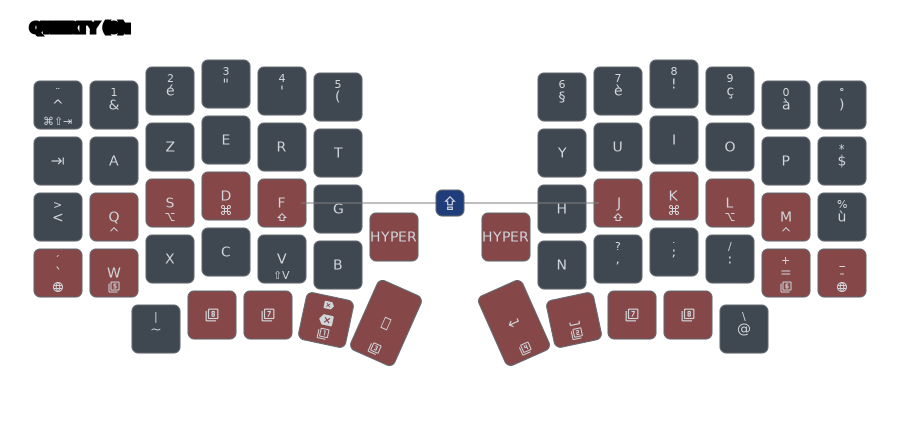
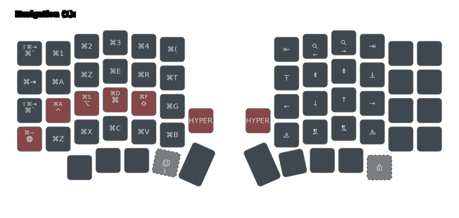
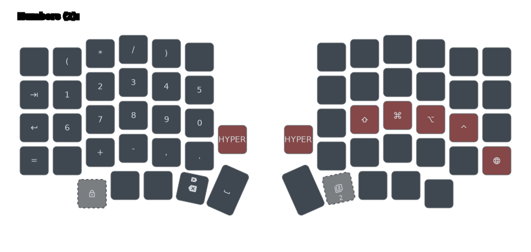
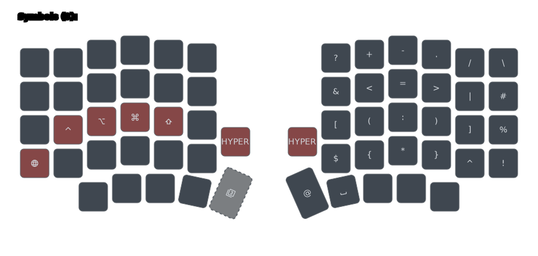
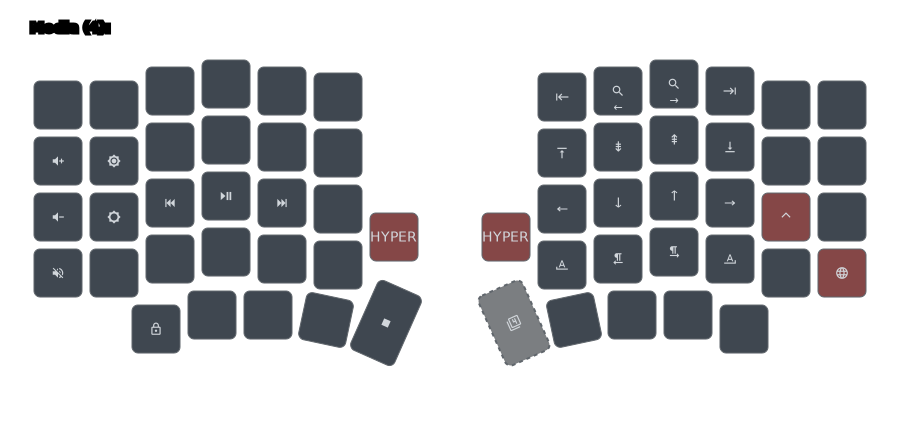
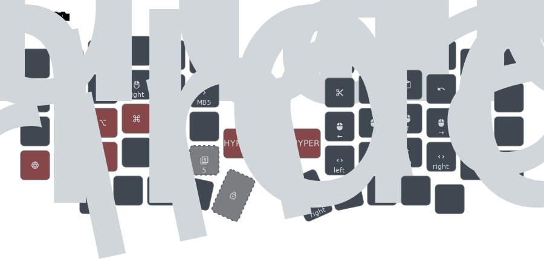
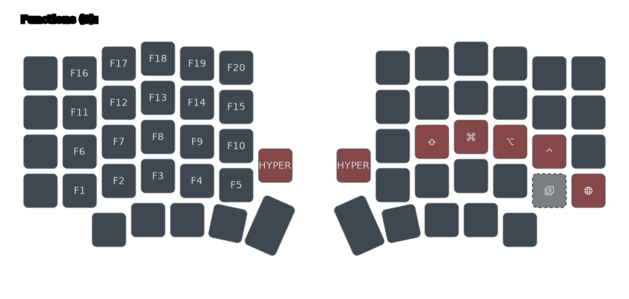
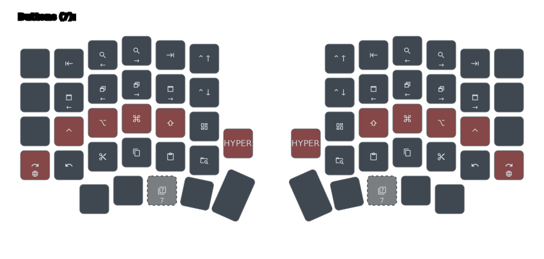
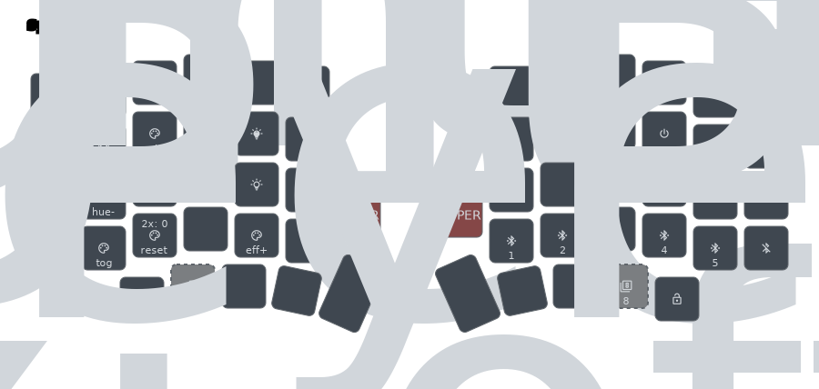

# Layout Sofle Choc Pro BT

## Lien avec la documentation d’origine (Townk)

| Rôle | Où le lire |
|------|------------|
| **Conventions générales** (glossaire des pictogrammes, représentation tap/hold, mod-morph, tap-dance, build amont…) | [README.md sur GitHub — Townk/zmk-config](https://github.com/Townk/zmk-config/blob/main/README.md) |
| **Récit « par clavier »** dont ce fichier est l’adaptation Sofle | [lily58.md sur GitHub](https://github.com/Townk/zmk-config/blob/main/docs/lily58.md) (équivalent historique Lily58) |

**`docs/sofle.md` (ce document)** = pendant **Sofle Choc Pro BT** de ce dépôt : il part des idées ci-dessus et décrit ce qui change (matrice, AZERTY ISO macOS, fichiers `config/`). Le glossaire détaillé et les légendes des schémas sont centralisés dans [README.md](README.md) (dossier `docs/`), lui-même dérivé du README Townk.

---

Ce clavier reprend la philosophie de la configuration [Townk/zmk-config](https://github.com/Townk/zmk-config), **transposée** sur un **Sofle Choc Pro Bluetooth** avec **AZERTY / ISO français** sous **macOS**.

Quelques principes hérités de cette base :

- **Couches « unilatérales »** : une couche momentanée évite en général de placer les actions utiles des **deux** côtés à la fois ; tu gardes les modificateurs sur la main qui a ouvert la couche, ce qui permet de les combiner avec les touches de l’autre moitié.
- **Nombres et symboles séparés** : deux couches distinctes pour aider à choisir la main / le contexte.
- **Couche raccourcis (Boutons)** : celle qui est en pratique la plus **symétrique** (édition / presse-papiers).
- **Couches momentanées + verrouillage** : accès principal au **maintien** d’une touche sur la couche AZERTY ; **verrouillage** via **`&tog L_*`** (ZMK v0.3, voir [Verrouillage des couches](#verrouillage-des-couches) ci-dessous). L’ancien behavior **`molock`** du fork Townk n’est plus utilisé.
- **Touches dynamiques** : mod-morph, hold-tap, tap-dance, tri-state (`&appswtnxt`, `&winswtnxt`, etc.).
- **Homerow mods « timeless »** : approche inspirée de [urob/zmk-config](https://github.com/urob/zmk-config), avec `tapping-term-ms` à **200** ms dans cette config.

> [!NOTE]
> Tout ce qui suit reflète des **choix personnels** adaptés au Sofle et au français sur macOS ; ce n’est pas une vérité universelle.

---

## Couche de base (AZERTY)

La couche **AZERTY** (couche 0, `MAIN` dans le firmware) concentre homerow mods, touches morphées et raccourcis macOS. C’est la couche à modifier en priorité si tu changes la disposition de base. Le firmware émet des codes HID « position US » ; macOS avec clavier **FR ISO** les réinterprète en AZERTY (voir `config/dsl/osx_fr_azerty_iso.yaml`).

### Rangée des chiffres

Le Sofle expose une **rangée supérieure** complète. Ici, la rangée 0 utilise des codes **HID classiques** (`N1` … `N0`) — comportement proche d’un clavier standard **sous macOS FR** (avec la couche **Symboles** et la couche **Nombres** pour les usages plus « pavé » ou les accords à deux mains).

### Homerow mods

Voir la config dans `config/layout/homerowmods.dtsi` et les paramètres **`tapping-term-ms = <200>`** alignés sur le reste des hold-tap / tap-dance. Par rapport à une config « textbook » urob, l’essentiel est ici : terme court pour des combos une main plus réactifs, et définitions `&hml` / `&hmr` cohérentes avec les pouces et les exclusions de conflit (`KEYS_L` / `KEYS_R` / `THUMBS` dans `sofle.keymap`).

### Caps Word

Pas de `CAPS_LOCK` classique : on utilise **`&caps_word`** (liste de continuation incluant underscore, tiret et retour arrière dans `standard_layout.dtsi`). Dans cette keymap, **Caps Word** est déclenché par un **combo** sur les positions matricielles **28 et 31** (voir `COMBO_KEY_CAPS_WORD` dans `sofle.keymap`) — sur la 3ᵉ rangée, cela correspond aux touches **F** et **J** (index sur la homerow).

Des comportements optionnels du type *double tap Globe → Caps Word* existent dans le dépôt Townk (`globecaps` dans `specialkeys.dtsi`) mais **ne sont pas branchés** sur la couche principale actuelle.

### Autoshift

Comme dans la doc Lily58 d’origine : **un** autoshift ciblé sur **`V`** (`AS(V)`), pratique notamment pour **Vim** (`Shift+V` ligne) lorsque le Shift homerow complique le geste une seule main.

### Navigation macOS (apps / fenêtres)

Même idée que Townk : raccourcis proches du clavier Apple pour **⌘⇥** / **⌘⇧⇥** et la bascule de **fenêtres** de l’app courante, via **tri-state** et **mod-morph** (`&appswtnxt`, `&winswtnxt`, `&lbktgrave`, `&appPwinN`, `&winPglobe`, etc. — détails dans `standard_layout.dtsi` et `specialkeys.dtsi`).

Touches spécifiques **AZERTY / ISO** : par exemple **`&opttildepipe`** (pouce) pour tilde / pipe côté macOS FR, et **`&globebslh`** pour Globe + antislash avec variante **⇧** (voir commentaires dans `standard_layout.dtsi`).

---

## Verrouillage des couches

Cette config repose sur **ZMK officiel v0.3** : il n’y a **plus** de touche universelle **`molock`** (behavior du fork Townk `mousemove-molock`). Le verrouillage repose sur des toggles **`&tog L_*`** et, pour une couche, sur un **tap-dance**.

### Momentané vs verrouillé

| Mode | Gestuelle | Effet |
|------|-----------|-------|
| **Momentané** | Maintenir une touche d’activation (hold-tap, layer-tap, etc.) depuis **AZERTY** | La couche overlay est active tant que la touche est enfoncée |
| **Verrouillé** | Appuyer une touche **`&tog L_*`** (cadenas sur les schémas) | La couche reste active après relâchement ; **réappuyer** la même touche la désactive |

Sur ZMK v0.3, **`&tog`** est un behavior « locking » : si tu verrouilles une couche **pendant** qu’elle est ouverte en momentané, **relâcher** la touche d’entrée ne la fermera plus — seul un nouveau **`&tog`** (ou un autre behavior locking) la coupe.

### Entrées depuis AZERTY (momentané)

| Couche | Touche (hold) |
|--------|----------------|
| Navigation | Hold **⎋** (pouce gauche) |
| Nombres | Hold **⌫** (pouce droit, `&bspcnum`) |
| Symboles | Hold **↵** (pouce gauche) |
| Média | Hold **Espace** (pouce gauche) |
| Souris | Hold **B** (rangée du bas gauche) |
| Fonctions | Hold **=** / **+** (droite) |
| Boutons | Hold **SF4** (pouces) |
| Système | Hold touche Sys (pouces) — **sans verrou couche** |

Un **tap** court sur ces touches envoie l’action normale (Esc, Backspace, Entrée, etc.).

### Toggles de verrouillage (sur l’overlay)

| Couche | Touche toggle | Schéma |
|--------|---------------|--------|
| Navigation | Pouce droit bas | Cadenas sur [Navigation](./images/sofle-layer1-navigation.svg) |
| Nombres | Pouce gauche bas | Cadenas sur [Nombres](./images/sofle-layer2-numbers.svg) |
| Symboles | Pouce droit bas | Cadenas sur [Symboles](./images/sofle-layer3-symbols.svg) |
| Média | Pouce (toggle média) | Voir [Média](./images/sofle-layer4-media.svg) |
| Souris | Pouce gauche | Cadenas sur [Souris](./images/sofle-layer5-mouse.svg) |
| Fonctions | — | **Pas de toggle** : momentané uniquement |
| Boutons | Double tap **SF4** depuis AZERTY (`&motg_but`) | Pas de cadenas sur l’overlay |
| Système | — | **Pas de toggle couche** |

Les **cadenas** sur les visuels correspondent aux vrais **`&tog`** du firmware (voir glossaire dans [README.md](README.md)). Les pictogrammes **numérotés** en gris (ghost) sur certaines overlays rappellent **d’où l’on entre** depuis AZERTY — c’est un aide visuelle Keymap Drawer, pas une touche de verrouillage.

### `&studio_unlock` (couche Système)

Les touches **`&studio_unlock`** sur la couche **Système** (pouces extérieurs gauche et droit — cadenas **ouvert** + libellé **KeyPeek** sur [le schéma](./images/sofle-layer8-system.svg)) ne verrouillent **pas** une couche clavier : elles **déverrouillent le firmware pour ZMK Studio / KeyPeek** (édition keymap via USB). Ce n’est **pas** le même geste que le cadenas **fermé** des toggles `&tog L_*` sur les autres overlays.

---

## Couche Navigation

Flèches alignées sur la homerow, **Home**, **Fin**, **Page ↑/↓**, et raccourcis **macOS** pour mots / lignes (`⌥←/→`, `⌘←/→`) lorsque les touches « natives » ne suffisent pas.

---

## Couche Nombres

Pavé numérique en **deux rangées** (logique Townk : moins de « sauts » de rangée qu’un pavé 3×4 classique pour certains profils). Les modificateurs homerow restent disponibles sur cette couche pour les combos.

---

## Couche Symboles

La couche Symboles du dépôt upstream s’inspire d’idées type **« Spaceship »** (symétrie des paires de caractères, etc.), mais **ici elle est recâblée** pour l’**ISO français** et les séquences **Option / Shift** attendues sous macOS (voir les commentaires dans `standard_layout.dtsi`). Le schéma Keymap Drawer reste la référence visuelle à jour.

---

## Couche Média

Contrôles média et luminosité ; organisation proche de l’esprit Townk (lecture au centre, variations verticales, **Échap** comme **stop** mémotechnique).

---

## Couche Souris

Pointage et défilement lorsque la pile ZMK inclut les comportements souris (voir définitions conditionnelles `MOVE_X_DECODE` dans `specialkeys.dtsi`).

---

## Couche Fonctions

Touches **F1–F5** et raccourcis associés ; alignement pensé pour rester utilisable si une rangée manque sur un autre split.

---

## Couche Boutons

Couche **la plus symétrique** : couper / copier / coller, Spotlight, etc., en miroir des deux côtés.

---

## Couche Système

Bluetooth, sortie USB/BLE, reset, bootloader, sous-couche **système** ; **pas** entièrement symétrique : certaines actions concernent une moitié du clavier (voir schéma).

---

## Fichiers utiles

| Élément | Emplacement |
|--------|-------------|
| Keymap générée / macro matrice | `config/sofle.keymap`, `config/layout/standard_layout.dtsi` |
| DSL / locale | `config/dsl/osx_fr_azerty_iso.yaml` |
| Schémas (génération) | `make keymap-images` à la racine du dépôt → `docs/images/` |
| Aperçu HTML empilé | [images/cheatsheet.html](images/cheatsheet.html) |

---

## Mentions

Les visuels de keymap sont produits avec [Keymap Drawer](https://keymap-drawer.streamlit.app/). Le **Sofle** est un design open source (voir la doc du fabricant / de ta révision PCB pour crédit matériel exact).
